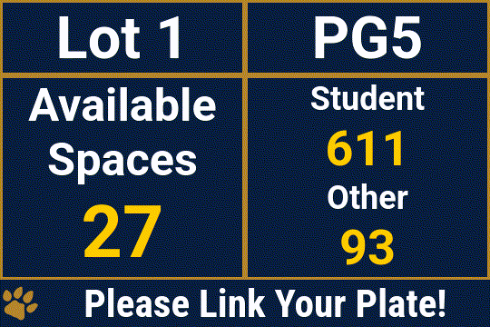

# 🐾 FIU Parking Signage 🐾

## Screenshots

## Overview

This repository contains the web-based templates for the Daktronics DMS signage
used around the Florida International University campus. It primarily displays
parking occupancy.

It includes functionality to display up to three different parking zones. If one
or more zones become full, it will perform a best effort swap to a zone that is
vacant. Zones that are to be swapped between are defined under
[`garageGroups`](https://github.com/gentmantan/fiu-dms-templates/blob/2397b43ae78dc00a00b53553e3cca90e9c1c8383/index.html#L132).

## Requirements

This template has only been deployed on DMP-50XX series controllers on firmware
`10.16.0.42` or higher. Lower firmwares seem to not have a browser that supports
[CSS container queries](https://developer.mozilla.org/en-US/docs/Web/CSS/CSS_containment/Container_queries)
which are required to have automatic sizing of the template. This template is
designed for displays with aspect ratios of 4:3, 3:2 and 2:1.

The data acquired for this template is in the form of XML files. Interestingly,
there are currently
[two data sources](https://github.com/gentmantan/fiu-dms-templates/blob/2397b43ae78dc00a00b53553e3cca90e9c1c8383/index.html#L128)
because we have two separate systems for counting occupancy. The `sensors` one
is soon to be deprecated.

## Installation

1. Edit
   [`garageGroups`](https://github.com/gentmantan/fiu-dms-templates/blob/2397b43ae78dc00a00b53553e3cca90e9c1c8383/index.html#L132)
   and the functions
   [`parseData`](https://github.com/gentmantan/fiu-dms-templates/blob/2397b43ae78dc00a00b53553e3cca90e9c1c8383/index.html#L373)
   and
   [`parseDataSensors`](https://github.com/gentmantan/fiu-dms-templates/blob/2397b43ae78dc00a00b53553e3cca90e9c1c8383/index.html#L417)
   in order to match the particular data source that you would like to parse
2. Put the `index.html` file on a web server accessible by the signs
3. Create a `.url` file to the template
   [as described here](https://www.daktronics.com/en-us/support/kb/000002396),
   with a query string containing a comma separated list of garages to be
   listed. For example, `<url>?garages=PG5,Lot+1`
4. Add the `.url` file to Venus control suite and schedule it to display on a
   sign
